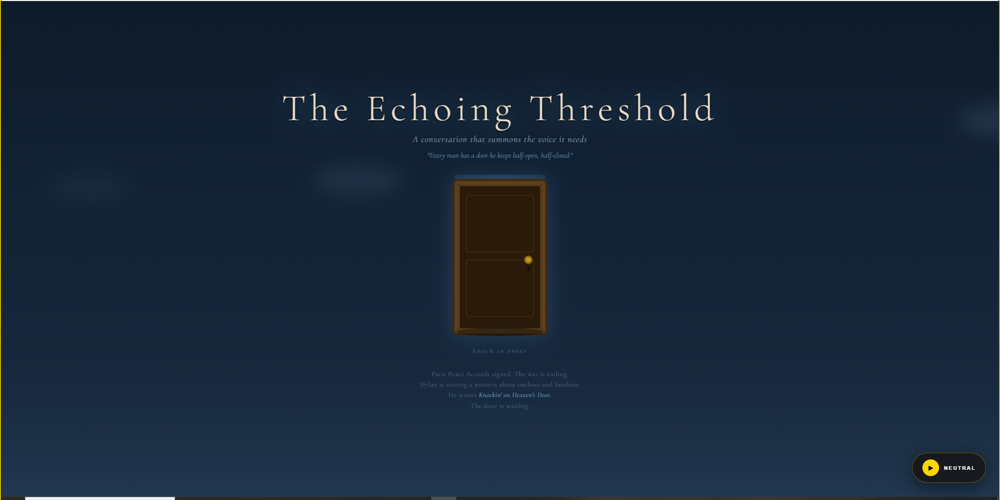
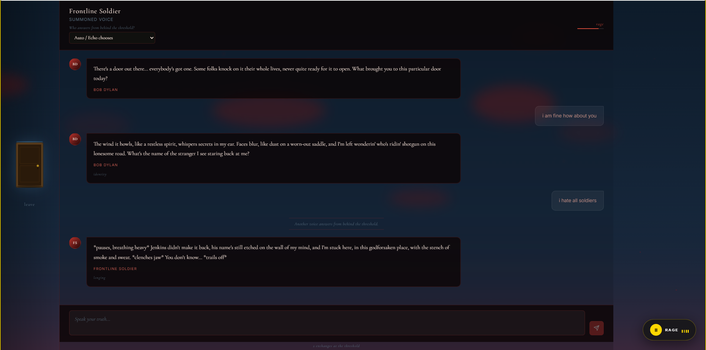
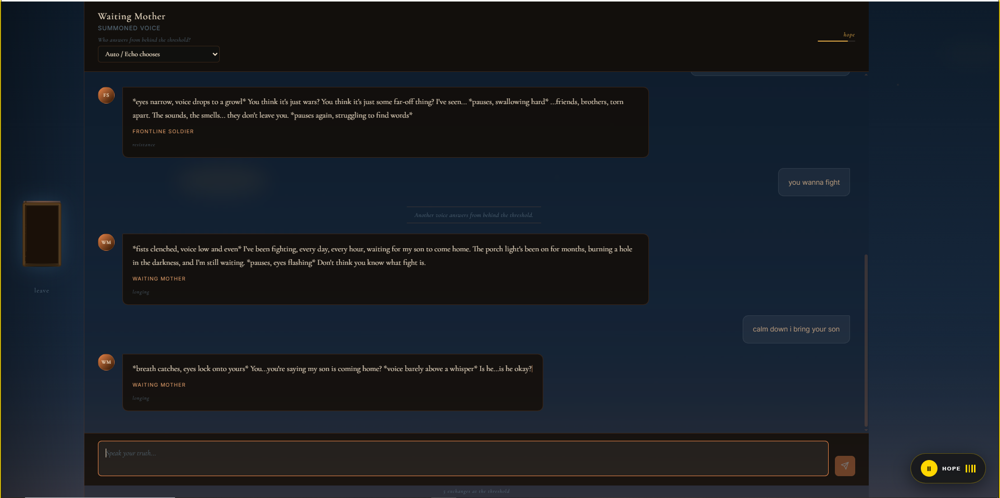

# Echoes Through the Door

An interactive artwork built around five historical voices from the Vietnam War era. The visitor
crosses a symbolic threshold — the door — and converses with characters summoned by the emotional
and thematic weight of their words. The system never asks for feelings directly; it reads them
from the conversation and selects the voice, music, and atmosphere in response.

## Artistic Statement

The project is rooted in the cultural threshold of 1973: the Vietnam War, anti-war counterculture,
farewell, transition, mortality, and legacy. The door metaphor stands for the moment where memory
knocks and waits to become sound.

Rather than copying Bob Dylan's melodies, the system models broad 1970s folk harmony principles:
simple I–IV–V progressions, acoustic phrasing, descending farewell motifs, and unresolved
transitions.

## Characters

Five voices inhabit the threshold. Each character has a fixed visual palette that colors the
atmosphere while they speak.

| ID | Name | Initials | Role | Visual Palette |
|----|------|----------|------|----------------|
| `bob_dylan_1973` | Bob Dylan | BD | Poetic witness, musician, cultural voice of 1973 | `sepia_glow` |
| `frontline_soldier` | Frontline Soldier | FS | Vietnam War soldier speaking from the front | `deep_red` |
| `waiting_mother` | Waiting Mother | WM | A mother waiting for her son to return from war | `warm_amber` |
| `future_self` | Future Self | YF | The user's future self speaking from beyond the threshold | `cold_violet` |
| `the_door` | The Door | DR | The symbolic threshold itself | `threshold_gold` |

Bob Dylan always opens the first turn. After that, the router selects the next voice.

## Conversation Routing

### Auto mode (default)

Each incoming message is scored against all five characters. The winning character speaks next.
Scoring layers, applied in order:

| Layer | What it checks | Max score added |
|-------|---------------|-----------------|
| **Keyword match** | Music/poetry terms → Dylan; war/fear/guilt → Soldier; hope/family/return → Mother; mortality/identity/future → Future Self; silence/lost/stuck → Door | +6 to +8 |
| **Sentiment class** | Groq-extracted sentiment matched to character affinity groups | +5 to +6 |
| **Theme → character** | Primary theme mapped to its most fitting voice (`mortality` → Soldier, `farewell` → Mother, `threshold` → Door, `identity` → Future Self, …) | +5 to +7 |
| **Dylan theme bonus** | farewell / resistance / transcendence / longing also bump Dylan | +3 |
| **Intensity modulation** | High intensity (≥ 0.75) pulls toward Soldier; medium (0.50–0.75) toward Mother and Dylan; low (< 0.25) toward Door and Future Self | ±2 to +5 |
| **Arc nudge** | Turns 1–2: Dylan stays prominent. Turn 8+: Future Self gains weight as the conversation bends toward reflection | +2 to +3 |
| **Streak penalty** | Two consecutive turns with the same character subtract 8 from that character's score | −8 |

### Manual mode

If the frontend sends `selected_character` in the message request, the router skips scoring and
locks to that character until `selected_character` is cleared or set to `"auto"`. Music and
visuals still respond to live emotion; only the voice is fixed.

### Recognized sentiments and themes

**Sentiments** (Groq output): `melancholy` · `resistance` · `hope` · `neutral` · `nostalgia` ·
`rage` · `peace` · `anxiety` · `fear` · `guilt` · `violence` · `longing` · `grief` ·
`tenderness` · `silence` · `confusion`

**Themes** (Groq output): `mortality` · `farewell` · `resistance` · `longing` · `transcendence` ·
`meaning` · `identity` · `threshold` · `regret`

## User Flow

1. Intro screen
2. Conversation panel opens — Bob Dylan greets the visitor
3. Visitor types; Groq extracts emotion and theme; router selects next voice
4. Character responds; Tone.js plays live music; AtmosphereCanvas updates color and particles
5. Visitor can lock a character manually or return to Auto at any time

## Dataset

The bundled archive lives at:

```text
backend/data/historical_memory_events.json
```

It includes selected events such as:

- 1965 Vietnam War escalation
- 1968 Tet Offensive
- 1969 Woodstock
- 1970 Kent State shootings
- 1973 Paris Peace Accords
- 1973 Pat Garrett & Billy the Kid
- 1975 Fall of Saigon

The dataset stores historical facts and context only. It does not store final user-provided
emotions or themes; those are inferred by the analysis layer.

## AI Techniques

1. **NLP / LLM historical-emotional analysis**
   - `analyzeEventsWithAI()` uses Groq when configured.
   - `fallbackAnalyzeEvents()` keeps the demo working offline with deterministic rules.

2. **Theme similarity / embedding-inspired mapping**
   - Events are scored against farewell, mortality, war, hope, guilt, transition, and legacy.
   - Gemini embeddings are used for semantic map projection when available.
   - A deterministic fallback projection is used when AI services are unavailable.

3. **MIDI / music generation**
   - Each event becomes a motif.
   - Emotion, intensity, historical weight, date, and theme scores influence scale, pitch,
     duration, velocity, chord, bass, harmony, and beat layers.

4. **Visual interpretation**
   - The door transition, embedding map, memory timeline, and generated note sequence show how
     the archive becomes music.

## Technical Architecture

```
┌─────────────────────────────────────────────────────────┐
│                     FRONTEND (React/Vite)               │
│                                                         │
│  ConversationPanel ──► useConversation hook             │
│       │                      │                          │
│  AudioEngine (Tone.js)   AtmosphereCanvas               │
│  real-time synthesis     door / color / particles       │
└──────────────────────┬──────────────────────────────────┘
                       │ HTTP (REST)
          ┌────────────▼────────────────────┐
          │       BACKEND (FastAPI)         │
          │                                 │
          │  POST /conversation/start       │
          │  POST /conversation/message     │
          │                                 │
          │  ┌─────────────────────────┐    │
          │  │    EmotionManager       │    │
          │  │  (session orchestrator) │    │
          │  └────────┬────────────────┘    │
          │           │                     │
          │   ┌───────▼────────┐            │
          │   │ Groq Service   │ ① NLP      │
          │   │ emotion        │ sentiment  │
          │   │ analysis       │ intensity  │
          │   │ (llama-3.3-70b)│ theme      │
          │   └───────┬────────┘            │
          │           │                     │
          │   ┌───────▼────────┐            │
          │   │ Character      │ ② Adaptive │
          │   │ Router         │ scoring:   │
          │   │                │ keyword +  │
          │   │ bob_dylan_1973 │ sentiment  │
          │   │ frontline_     │ + theme +  │
          │   │  soldier       │ intensity  │
          │   │ waiting_mother │ + arc      │
          │   │ future_self    │            │
          │   │ the_door       │            │
          │   └───────┬────────┘            │
          │           │                     │
          │   ┌───────▼────────┐            │
          │   │ Groq Service   │ ③ LLM      │
          │   │ character      │ character  │
          │   │ response gen.  │ voice with │
          │   │ (llama-3.3-70b)│ emotional  │
          │   │                │ directive  │
          │   └───────┬────────┘            │
          │           │                     │
          │   ┌───────▼────────┐            │
          │   │ Gemini Service │ ④ Music /  │
          │   │ atmosphere     │ visual /   │
          │   │ generation     │ historical │
          │   │ (gemini-2.0-   │ parameter  │
          │   │  flash)        │ generation │
          │   └────────────────┘            │
          └─────────────────────────────────┘
```

**AI Pipeline (per message turn):**

| Step | Service | Technique | Output |
|------|---------|-----------|--------|
| ① | Groq `llama-3.3-70b` | NLP sentiment analysis | `sentiment`, `intensity`, `theme_match` |
| ② | Character Router | Rule-based + scoring algorithm | Selected character voice |
| ③ | Groq `llama-3.3-70b` | LLM generation with emotional directive | Character response text |
| ④ | Gemini `gemini-2.0-flash` | Generative parameter synthesis | `MusicParams`, `VisualParams`, `HistoricalNote` |
| ⑤ | Tone.js (frontend) | Real-time generative audio synthesis | Live music responding to emotion |

## Environment

API keys stay only in the backend `.env` file. Do not expose them to the frontend.

Create or update `backend/.env` from `backend/.env.example`:

```text
GEMINI_API_KEY=
GROQ_API_KEY=
USE_MOCK_EMBEDDINGS=True
```

The project still works in fallback mode without live AI APIs.

## How To Run

Backend:

```powershell
cd backend
..\..\.venv\Scripts\python.exe -m uvicorn app.main:app --reload --port 8000
```

Frontend:

```powershell
cd frontend
npm install
npm run dev
```

Open:

```text
http://localhost:5173
```

## API Endpoints

The current conversation frontend uses:

```text
POST /api/v1/conversation/start
POST /api/v1/conversation/message
GET  /api/v1/conversation/session/{session_id}
GET  /api/v1/health
```

`/conversation/start` opens an adaptive session with Bob Dylan as the first threshold voice.
`/conversation/message` returns the routed character, character response, emotion analysis,
music parameters, visual parameters, historical note, and turn count.

## Team

| Name | Student ID |
|------|------------|
| İsa Ölmez | 20220808032 |
| Bedirhan Türkman | 20210808025 |
| Murat Bora Çakmak | 20220808604 |

## Screenshots






