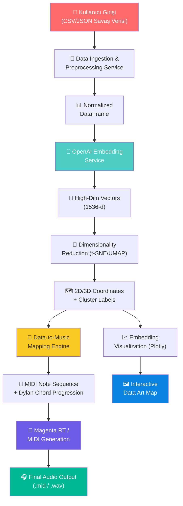
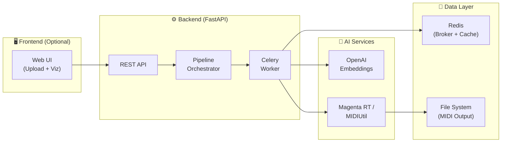

# Echoes of the Vietnam Frontier — Teknik Uygulama Planı

> **Proje:** CSE 358 "KNOCK-Design Your Door"  
> **Konsept:** Vietnam Savaşı'nın soğuk verilerini Bob Dylan'ın akor dizilimleriyle birleştiren bir Veri Sonifikasyonu (Data Art) çalışması.

---

## 1. Seçilen İki AI Modeli ve Gerekçeleri

### Model 1: OpenAI `text-embedding-3-small`

| Özellik | Detay |
|---------|-------|
| **Amaç** | 1973 yılına ait haber başlıklarını / savaş verilerini vektör uzayına yerleştirmek (Embedding Visualization) |
| **Boyut** | 1536-d vektör (veya `dimensions` parametresiyle düşürülebilir, ör. 256-d) |
| **Maliyet** | ~$0.02 / 1M token — çok düşük maliyet |
| **Neden Bu?** | |

1. **Semantik Kümeleme:** Haber başlıklarını cosine similarity ile gruplara ayırarak "hangi olaylar birbirine yakın?" sorusuna yanıt verir. Bu kümeler doğrudan müzikal seksiyonlara dönüştürülür.
2. **Boyut İndirgeme:** t-SNE veya UMAP ile 2D/3D'ye indirgendiğinde hem görsel bir "veri haritası" hem de müzikal parametrelere (x→pitch, y→velocity) doğrudan mapping yapılabilir.
3. **Alternatiflerinden Üstünlüğü:** Sentence-BERT veya Cohere Embed'e göre daha güncel, daha ucuz ve OpenAI ekosistemiyle doğal entegre.

### Model 2: Google Magenta RealTime (magenta-rt)

| Özellik | Detay |
|---------|-------|
| **Amaç** | Embedding vektörlerinden türetilen nota/akor dizilerini müzikal parçalara dönüştürmek |
| **Model Boyutu** | 800M parametre transformer |
| **Çalışma Ortamı** | Lokal (CPU/GPU) veya Google Colab TPU |
| **Neden Bu?** | |

1. **Gerçek Zamanlı Üretim:** Text prompt veya audio input ile yönlendirilebilir — Dylan'ın akor dizilerini (G-D-Am7, G-D-C) prompt olarak verebiliriz.
2. **Açık Ağırlıklar:** HuggingFace üzerinde mevcut, akademik projeler için uygun lisans.
3. **Kontrol Edilebilirlik:** Akor progressionları, tempo ve tonalite üzerinde kontrol sağlayarak veri-driven müzik üretimine olanak tanır.

> [!IMPORTANT]
> **Alternatif Yedek Plan:** Magenta RT kurulumu sorunlu olursa, `MIDIUtil` kütüphanesi ile **algoritmik MIDI üretimi** yapılır. Bu durumda model yerine kendi yazdığımız mapping algoritması müziği üretir — bu da "original code" kriterini daha da güçlü karşılar.

---

## 2. Pipeline Tasarımı (Veri Akışı)



### Adım Adım Akış:

| Adım | Bileşen | Girdi | Çıktı | Orijinal Mantık |
|------|---------|-------|-------|-----------------|
| 1 | **Data Ingestion** | Ham CSV/JSON | Temizlenmiş DataFrame | Tarih ayrıştırma, koordinat doğrulama, boş değer interpolasyonu |
| 2 | **Embedding Generation** | Metin başlıkları | 1536-d vektörler | Prompt mühendisliği: ham başlığa bağlam ekleme ("Vietnam War 1973: ...") |
| 3 | **Dimensionality Reduction** | Yüksek boyutlu vektörler | 2D koordinatlar + küme etiketleri | HDBSCAN ile otomatik kümeleme, küme sayısı → müzikal seksiyon sayısı |
| 4 | **Musical Mapping** | 2D koordinatlar + metadata | MIDI note dizisi | **Özel algoritma:** x→pitch (pentatonik skala), y→velocity, cluster→akor progressionu, tarih→tempo |
| 5 | **Music Generation** | MIDI notalar + akor progressionu | .mid dosyası | Dylan akor dizileriyle harmonizasyon kuralları |
| 6 | **Visualization** | 2D koordinatlar + kümeler | İnteraktif Plotly grafiği | Her noktaya tıklandığında ilgili melodiyi çalma |

---

## 3. Backend Mimarisi

### Dizin Yapısı

```
AI-Project/
├── app/
│   ├── __init__.py
│   ├── main.py                    # FastAPI application entry point
│   ├── config.py                  # Settings & environment variables
│   │
│   ├── api/
│   │   ├── __init__.py
│   │   ├── routes/
│   │   │   ├── __init__.py
│   │   │   ├── pipeline.py        # /pipeline/* endpoints
│   │   │   ├── visualization.py   # /viz/* endpoints
│   │   │   └── health.py          # /health endpoint
│   │   └── dependencies.py        # Shared FastAPI dependencies
│   │
│   ├── models/
│   │   ├── __init__.py
│   │   ├── schemas.py             # Pydantic request/response models
│   │   └── data_models.py         # Internal data structures
│   │
│   ├── services/
│   │   ├── __init__.py
│   │   ├── data_ingestion.py      # CSV/JSON parsing & cleaning
│   │   ├── embedding_service.py   # OpenAI Embedding API wrapper
│   │   ├── reduction_service.py   # t-SNE/UMAP dimensionality reduction
│   │   ├── mapping_service.py     # Data → Music mapping (CORE LOGIC)
│   │   ├── music_service.py       # MIDI generation / Magenta RT
│   │   └── visualization_service.py # Plotly chart generation
│   │
│   ├── core/
│   │   ├── __init__.py
│   │   ├── pipeline_orchestrator.py # Pipeline coordination
│   │   ├── music_theory.py        # Scales, chords, Dylan progressions
│   │   └── data_transforms.py     # Normalization, scaling utilities
│   │
│   └── tasks/
│       ├── __init__.py
│       └── celery_tasks.py        # Async task definitions
│
├── data/
│   ├── sample_vietnam_data.csv    # Sample dataset
│   └── dylan_chords.json          # Bob Dylan chord progressions
│
├── output/
│   └── .gitkeep                   # Generated MIDI/audio files
│
├── tests/
│   ├── __init__.py
│   ├── test_data_ingestion.py
│   ├── test_mapping_service.py
│   └── test_music_theory.py
│
├── .env.example                   # API key template
├── .gitignore
├── requirements.txt
├── Dockerfile
├── docker-compose.yml
├── README.md
└── architecture_diagram.png
```

### API Endpoints

| Method | Endpoint | Açıklama | Response |
|--------|----------|----------|----------|
| `POST` | `/api/v1/pipeline/upload` | CSV/JSON veri yükleme | `{task_id, status: "processing"}` |
| `GET` | `/api/v1/pipeline/status/{task_id}` | Pipeline durumu sorgulama | `{status, progress_pct, current_step}` |
| `GET` | `/api/v1/pipeline/result/{task_id}` | Sonuç indirme (MIDI + viz) | `{midi_url, visualization_url, metadata}` |
| `POST` | `/api/v1/pipeline/configure` | Mapping parametreleri ayarlama | `{config_id}` |
| `GET` | `/api/v1/viz/embedding/{task_id}` | İnteraktif embedding haritası | HTML/JSON Plotly chart |
| `GET` | `/api/v1/health` | Sistem sağlık kontrolü | `{status: "ok", services: {...}}` |

### Asenkron Görev Yönetimi

```
Client → FastAPI → Redis (Broker) → Celery Worker → Redis (Result Backend)
                                         ↓
                                   OpenAI API + MIDI Generation
```

- **Neden Asenkron?** Embedding üretimi + boyut indirgeme + müzik üretimi toplamda 10-30 saniye sürebilir.
- `POST /upload` → 202 Accepted + `task_id` döner → Client polling ile sonucu alır.

---

## 4. "Original Code" — API Wrapper'ın Ötesinde Özel Mantıklar

> [!WARNING]
> Sadece `openai.embeddings.create()` çağırmak bir "wrapper" dır. Değerlendirmecileri ikna etmek için aşağıdaki katmanlar **şarttır**.

### 4.1 Prompt Mühendisliği Katmanı (Embedding Enrichment)

```python
# Ham veri: "Ceasefire agreement signed"
# Zenginleştirilmiş prompt:
"[Vietnam War, January 1973, Paris] Context: The ceasefire agreement was signed, 
marking a pivotal moment. Sentiment: diplomatic/hopeful. Category: peace_talks"
```

Ham başlıklar embedding'e gönderilmeden önce **tarih, konum, kategori ve duygu** bilgisi eklenerek semantik zenginlik artırılır.

### 4.2 Musical Mapping Engine (Çekirdek Orijinal Algoritma)

Bu, projenin **en özgün** parçası — hiçbir hazır kütüphanede bulunmayan bir veri→müzik dönüşüm motoru:

```python
class MusicalMappingEngine:
    """
    2D embedding koordinatlarını müzikal parametrelere dönüştürür.
    
    Mapping Kuralları:
    - x koordinatı → Pitch (pentatonik skala: C, D, E, G, A)
    - y koordinatı → Velocity (ses şiddeti: 40-120 MIDI)
    - cluster_id  → Akor progressionu (Dylan dizileri)
    - tarih       → Tempo (BPM: savaş yoğunluğu → hızlı tempo)
    - casualties  → Note duration (fazla kayıp → uzun, ağır notalar)
    """
```

### 4.3 Veri Filtreleme ve Anomali Tespiti

- **Tarih doğrulama:** 1955-1975 aralığı dışındaki tarihlerin filtrelenmesi
- **Koordinat sınırları:** Vietnam coğrafyası dışındaki noktaların işaretlenmesi
- **Outlier detection:** IQR yöntemiyle aşırı değerlerin müzikal aralığa kliplenmesi

### 4.4 Müzik Teorisi Kuralları (music_theory.py)

```python
DYLAN_PROGRESSIONS = {
    "knockin_verse":  ["G", "D", "Am7"],
    "knockin_chorus": ["G", "D", "C"],
    "blowin_wind":    ["G", "C", "G", "D"],
}

PENTATONIC_SCALES = {
    "C_major_pentatonic": [60, 62, 64, 67, 69],  # C, D, E, G, A
    "A_minor_pentatonic": [57, 60, 62, 64, 67],   # A, C, D, E, G
}
```

Bu kurallar **hardcoded** değil, veri kümesine göre **dinamik seçilir** — negatif duygu kümelerine minör, pozitif duygu kümelerine majör tonalite atanır.

### 4.5 Emergent Results (Ortaya Çıkan Sonuçlar)

**Tek başına yapılamayan, ancak iki AI'nin birleşiminden doğan sonuç:**

Embedding modeli haber başlıklarını kümelediğinde, "barış müzakereleri" başlıkları bir yerde, "bombardıman" başlıkları başka yerde toplanır. Bu kümeler farklı Dylan akor progressionlarına atanır. Sonuçta:
- Barış kümeleri → `G-D-C` (majör, umutlu)
- Savaş kümeleri → `G-D-Am7` (minör, hüzünlü)
- Geçiş bölgeleri → ikisi arasında modülasyon

Bu, **ne sadece embedding ne de sadece müzik üretimi ile elde edilebilecek** bir "emergent" sonuçtur.

---

## 5. Boilerplate Kod Yapısı (Detaylı)

Aşağıda oluşturulacak dosyalar ve temel sınıf yapıları:

### `app/config.py`
```python
from pydantic_settings import BaseSettings

class Settings(BaseSettings):
    OPENAI_API_KEY: str
    REDIS_URL: str = "redis://localhost:6379/0"
    CELERY_BROKER_URL: str = "redis://localhost:6379/0"
    
    # Musical defaults
    DEFAULT_SCALE: str = "C_major_pentatonic"
    DEFAULT_TEMPO: int = 72
    DEFAULT_PROGRESSION: str = "knockin_verse"
    
    class Config:
        env_file = ".env"
```

### `app/services/embedding_service.py`
```python
class EmbeddingService:
    async def generate_embeddings(self, texts: list[str]) -> np.ndarray: ...
    def enrich_prompt(self, raw_text: str, metadata: dict) -> str: ...
```

### `app/services/mapping_service.py`
```python
class MappingService:
    def map_coordinates_to_notes(self, coords_2d, clusters, metadata) -> MidiSequence: ...
    def select_chord_progression(self, cluster_sentiment: float) -> list[str]: ...
    def calculate_tempo(self, date: datetime, intensity: float) -> int: ...
```

### `app/services/music_service.py`
```python
class MusicService:
    def generate_midi(self, sequence: MidiSequence, config: MusicConfig) -> bytes: ...
    async def generate_with_magenta(self, prompt: str, seed_notes: list) -> bytes: ...
```

### `app/core/pipeline_orchestrator.py`
```python
class PipelineOrchestrator:
    async def execute(self, raw_data: pd.DataFrame, config: PipelineConfig) -> PipelineResult:
        # Step 1: Ingest & Clean
        # Step 2: Generate Embeddings
        # Step 3: Reduce Dimensions
        # Step 4: Map to Music
        # Step 5: Generate MIDI/Audio
        # Step 6: Create Visualization
        ...
```

---

## 6. Teknik README Taslağı

### Architecture Diagram



### Installation Instructions Taslağı

```markdown
## Prerequisites
- Python 3.11+
- Redis Server
- OpenAI API Key

## Quick Start
1. Clone: `git clone <repo> && cd AI-Project`
2. Environment: `cp .env.example .env` → API anahtarınızı ekleyin
3. Install: `pip install -r requirements.txt`
4. Redis: `docker run -d -p 6379:6379 redis:alpine`
5. Server: `uvicorn app.main:app --reload`
6. Worker: `celery -A app.tasks.celery_tasks worker --loglevel=info`
7. Test: `curl -X POST http://localhost:8000/api/v1/pipeline/upload -F "file=@data/sample.csv"`
```

---

## 7. Zorluk ve Ölçekleme Stratejileri

| Zorluk | Strateji |
|--------|----------|
| **API Key Güvenliği** | `.env` + `pydantic-settings` + `.gitignore` — asla koda gömme |
| **Rate Limiting** | OpenAI: batch embedding (max 2048 input/call), exponential backoff retry |
| **Yanıt Süreleri** | Celery ile asenkron işlem, Redis cache ile tekrarlayan embedding'leri önbelleğe alma |
| **Büyük Veri Setleri** | Chunk processing: 500'lük batch'ler halinde embedding üretimi |
| **Model Erişilebilirliği** | Magenta RT yoksa → MIDIUtil fallback (graceful degradation) |
| **Tekrarlanabilirlik** | Random seed sabitleme (t-SNE, kümeleme) ile aynı veri → aynı müzik |

---

## 8. Doğrulama Planı

### Otomatik Testler
```bash
# Unit testler
pytest tests/ -v

# API entegrasyon testi
pytest tests/test_api.py -v --cov=app

# Linting
ruff check app/
```

### Manuel Doğrulama
1. `sample_vietnam_data.csv` ile pipeline'ı uçtan uca çalıştır
2. Üretilen `.mid` dosyasını bir MIDI player'da dinle
3. Plotly visualization'ın interaktif çalıştığını tarayıcıda doğrula
4. Farklı veri setleriyle farklı müzikal çıktılar üretildiğini kontrol et

---

## Open Questions

> [!IMPORTANT]
> **Soru 1:** Magenta RealTime modelini lokal olarak kurmayı mı tercih edersin, yoksa MIDIUtil ile tamamen algoritmik MIDI üretimi yeterli mi? (Magenta RT ~4GB GPU bellek gerektirir)

> [!IMPORTANT]
> **Soru 2:** Gerçek Vietnam Savaşı verisi (NARA arşivlerinden) mi kullanmak istersin, yoksa sentetik/örnek veri seti oluşturalım mı? Gerçek veri daha etkileyici olur ama temizleme süresi ekler.

> [!IMPORTANT]
> **Soru 3:** Frontend (web UI) gerekli mi, yoksa salt backend API + Jupyter notebook demo yeterli mi?

> [!IMPORTANT]
> **Soru 4:** Redis/Celery kurulumu yerine daha basit bir `asyncio.create_task()` yaklaşımı ile başlamak ister misin? Akademik proje için yeterli olabilir.

> [!NOTE]
> **Maliyet Tahmini:** OpenAI Embedding API ile ~1000 haber başlığını işlemek yaklaşık $0.001'den az tutar. Bütçe açısından sorun teşkil etmez.
